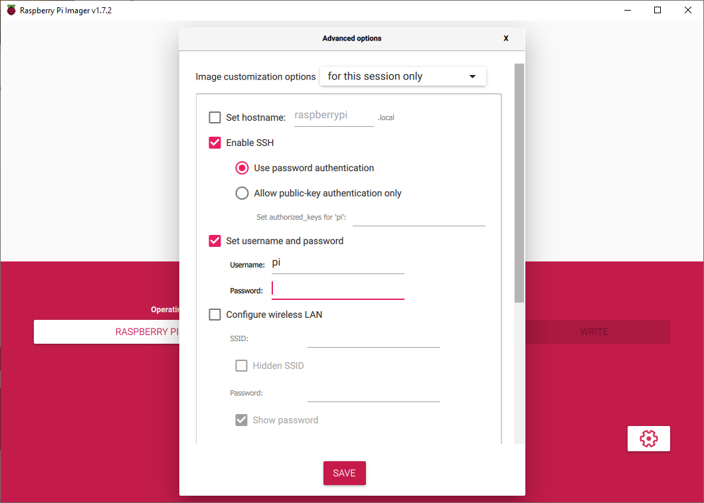
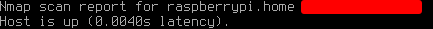
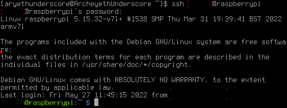
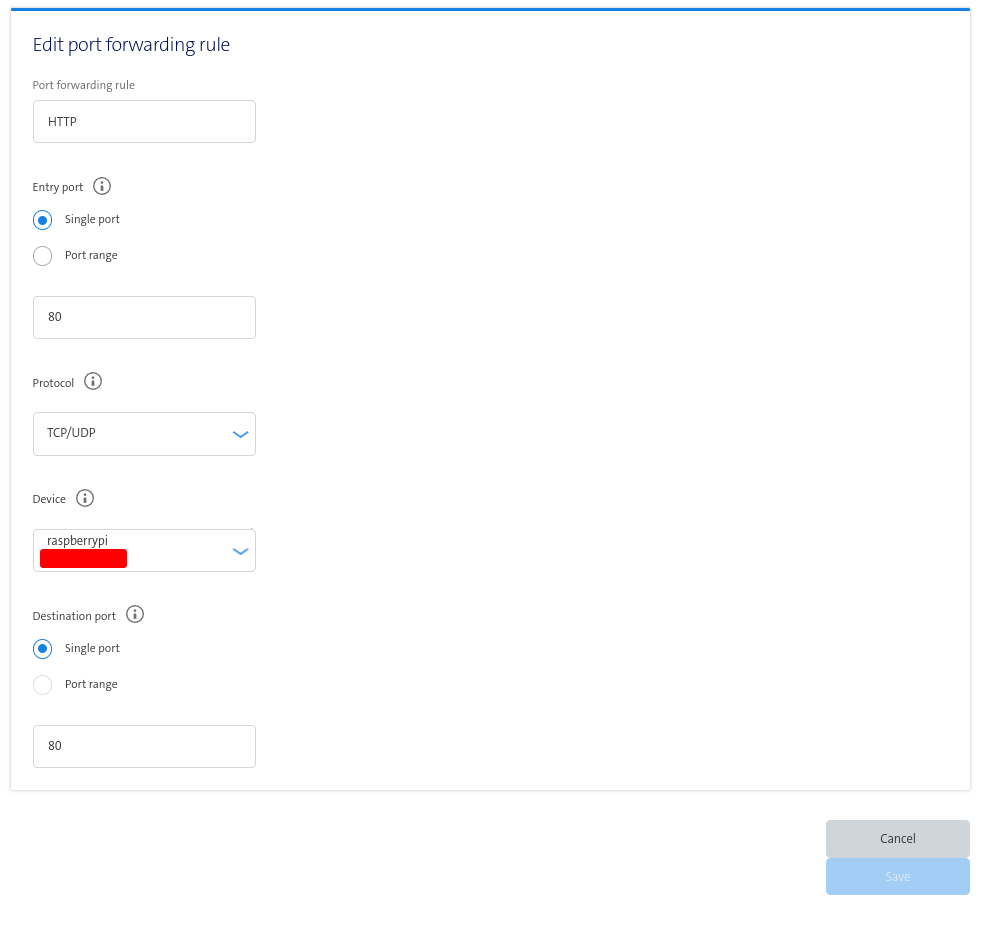
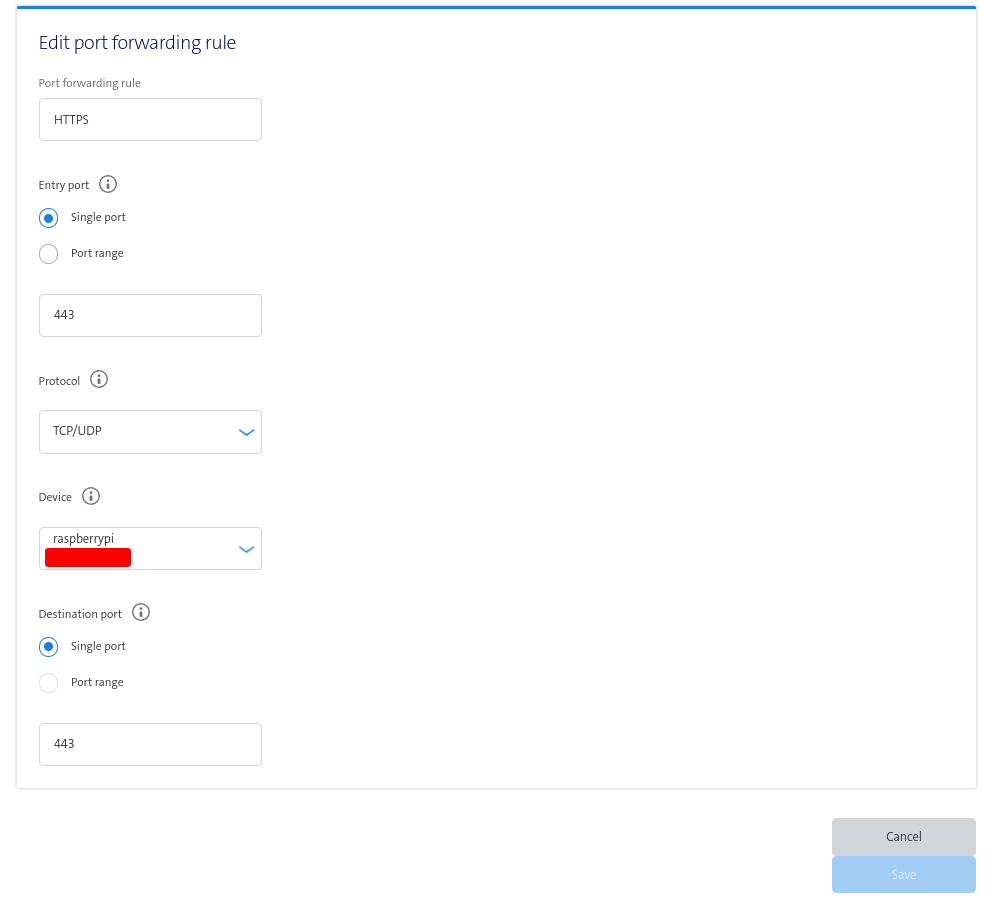
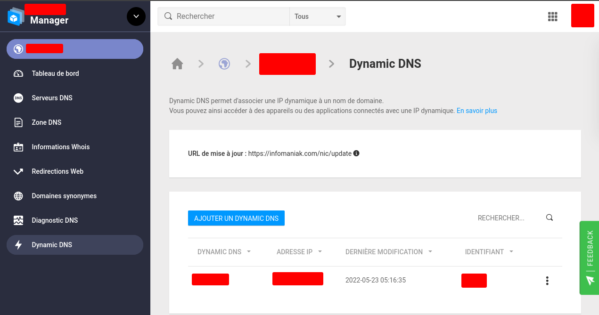
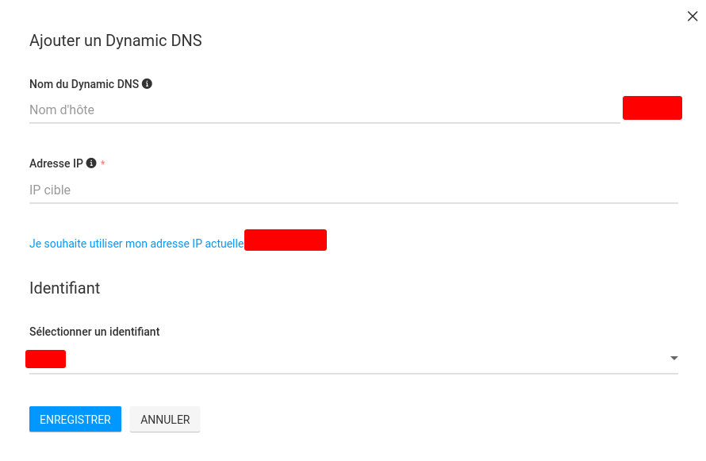
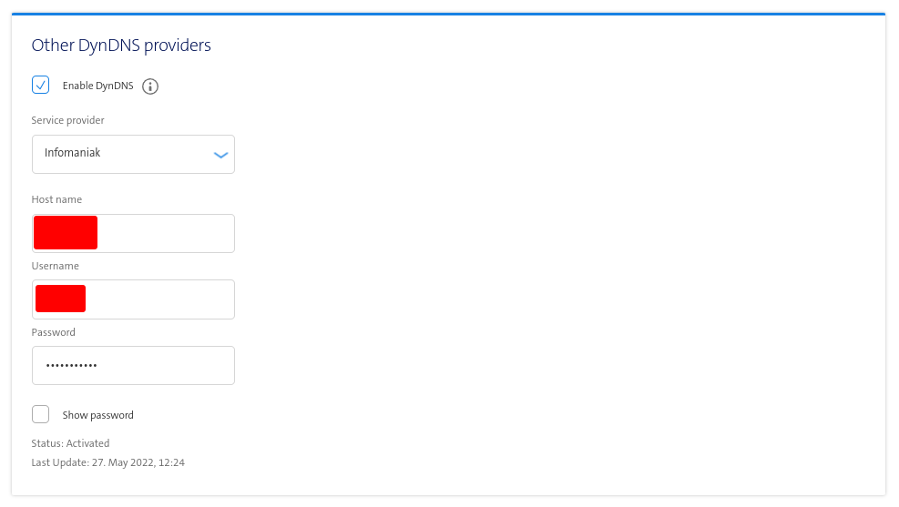

# Headless rpi webserver / website hosting at home

This repo pretty much explains how to create a web hosting server on a raspberry pi, using swisscom's dynamic DNS (DDNS) config, and an Infomaniak domain.
This guide is divided in 5 parts :  
Note that this guide is currently in the writings :neckbeard:
  - [Configurating rpi and ssh](#configurating-rpi-and-ssh)
  - [Apache installation](#apache-installation)
  - [Your first webpage](#your-first-webpage)
  - [Opening your ports](#opening-your-ports)
  - [Swisscom's DDNS config](#swisscoms-ddns-config)
  
Enjoy the guide !  

## Configurating rpi and ssh
---
First things first : we're going to need to set up your raspberry pi.  
For this build, I used raspberry pi's imager that you can find on their [website](https://www.raspberrypi.com/software/).  
I used for this project the Lite 32-bit OS, because I do not feel that there is a need for any GUI when using the computer in a headless mode.  
Using the imager, you can already define a ssh username and password in the advanced options:  
  
You can also modify the Wifi settings there, but I prefer using direct ethernet connection.
You now should be able to ssh into your machine when you will connect it to the ethernet cable and power it up.  
To find the raspberry pi ip, you can use [nmap](https://nmap.org/). This [tutorial](https://vitux.com/find-devices-connected-to-your-network-with-nmap/) can help you if you never used this tool too.  
  
The output should look something like this, and your ip should be where the red rectangle is.

To now (finally) ssh into your soon-to-be server, you will need to type in your terminal (using linux here, follow [this](https://jarrodstech.net/how-to-raspberry-pi-ssh-on-windows-10/) for windows) : `ssh [your username]@[raspberry ip]`. You will then be asked for your password, and you should be able to login to something that looks like this :  
  
Congratz ! You're now connected onto your headless raspberry pi :)
## Apache installation
To put up your webpage, we are going to use [Apache](https://www.apache.org/).  
In your raspberry pi, you will need to install apache by using this command : `sudo apt-get install apache2 -y`.  
You should now already be able to see on your local network the server working by going on `https://[your-raspberry-pi-ip`  

This is already pretty nice in my opinion, but we're still not done yet !
## Your first webpage
The default apache webpage should have normally appeared on the last step of this tutorial. This page is actually hosted on your raspberry pi, and you should
be able to find it on your raspberry pi at `/var/www/html/index.html`. You can modify this page already to put up your own;  
To put up your first webpage on your website, you can use this [example page](assets/examplePage.html), or create your own.  
You should now be able to go back to the page and see the changes that you made.
\
*Note: you can also at this step install PHP or any other packages that you will want to use on your website.*
## Opening your ports
To get your webpage on the world wide web, we will now need to open some router ports. As said before, we will cover it with the Swisscom router.  
To access the router, you will have to go to [this page](http://internetbox.home/#login). You should now be able to login with your password.  
Once on the page, activate "expert mode" if you have it unchecked. You should now be able to go into the "Network Settings", and from there access the "Port Forwarding" subtab.
You will now need to create two new rules for your raspberry pi, opening the ports 443 and 80. The rules should look as this :  

  
While you're in there, I would recommend you disable the "use IPV6" option, I have found it to be easier to setup using an ipv4.
## Swisscom's DDNS config

Almost done !  
You will now need to access your domain on Infomaniak (if you havent got one yet, they're pretty cheap). We will now go in the "Dynamic DNS" tab, where we will need to add a new DNS.
  
You will now need to add a new Dynamic DNS ("ajouter un dns dynamique" in the pic), and complete the required fields. Note that if you cant find your IP, [this tool](https://wtfismyip.com/) comes in handy.  

When you are done setting up this DNS, we will need to go back in the swisscom router (please note down your username / password somewhere too !)  
In the swisscom page, still in the Network settings, we will now need to go in the "DynDNS" tab. Under "other DNS providers", you will need to enable DynDNS, then add "Infomaniak" as the provider and fill in the rest as asked.
.
Hit save when everything is good, and you should now soon be able to connect to your website through your domain !  

That's it for this guide, do not hesitate to open a pull request, or to [send me a mail](mailto:leo.bernard2002@gmail.com) if you find anything to fix.  
You can also [buy me a beer](https://www.paypal.com/paypalme/aryethunderscore) if you enjoyed this guide :)

Enjoy playing with your webserver !
